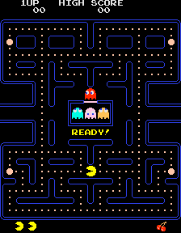
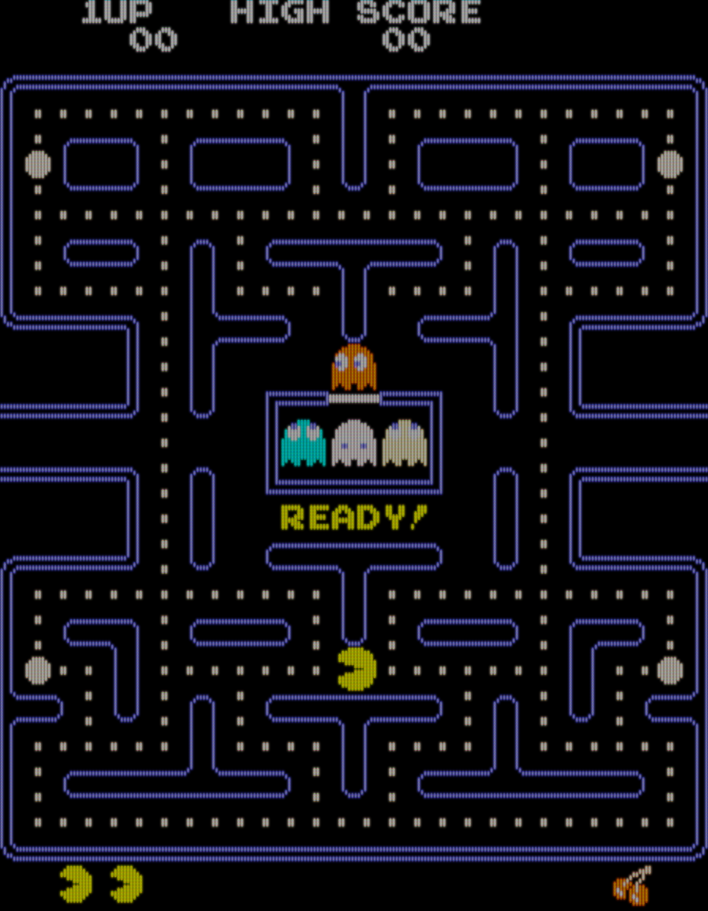
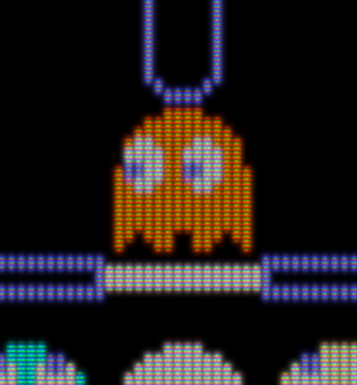

This program reads a low-resolution image, such as a screenshot of
an ’80s video game, and renders it at high resolution with a CRT
shadowmask effect.

For example, given this 228×288 screenshot:

and these command line flags:

    --type INLINE --portrait pac-man-orig.png pac-man-out.png 5760

it'll generate this 4480×5760 image:

Here's a detail of Blinky:

The `--type` flag chooses the type of shadow mask. Use `DELTA` for old-style
dots in a triangle pattern or `INLINE` for the more modern dashes. (The name
refers the arrangement of the electron guns.) The default is `DELTA`.

The `--portrait` flag is for situations where, as in Pac-Man, the CRT was
mounted vertically and the electron gun ran vertically.

The next two parameters are the input and output image pathnames.

The last parameter is the width of the output image, or the height when
`--portrait` is specified. Try 20 times the input width (or height),
as in the above example.

# License

Copyright 2018 Lawrence Kesteloot

Licensed under the Apache License, Version 2.0 (the "License");
you may not use this file except in compliance with the License.
You may obtain a copy of the License at

   http://www.apache.org/licenses/LICENSE-2.0

Unless required by applicable law or agreed to in writing, software
distributed under the License is distributed on an "AS IS" BASIS,
WITHOUT WARRANTIES OR CONDITIONS OF ANY KIND, either express or implied.
See the License for the specific language governing permissions and
limitations under the License.
